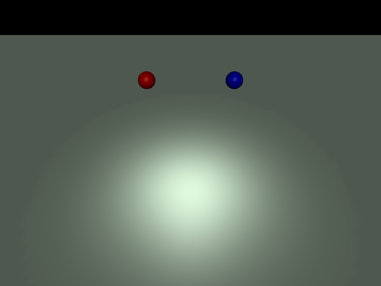

# ex11_freefall: 자유 낙하 (Free Fall)

이 예제는 MuJoCo에서 중력의 영향을 받는 두 물체의 낙하를 시뮬레이션하고, 탄성(`solref`) 파라미터가 충돌에 미치는 영향을 비교합니다.

## 📝 설명
- **빨간색 공 (Elastic):** `solref="0.02 1"` 설정으로 지면에 닿았을 때 통통 튀어 오릅니다.
- **파란색 공 (Inelastic):** `solref="0.1 1"` 설정으로 지면에 닿았을 때 덜 튀어 오릅니다.

## 📸 실행 화면


## 🏃 실행 방법
```bash
uv run main.py
```
