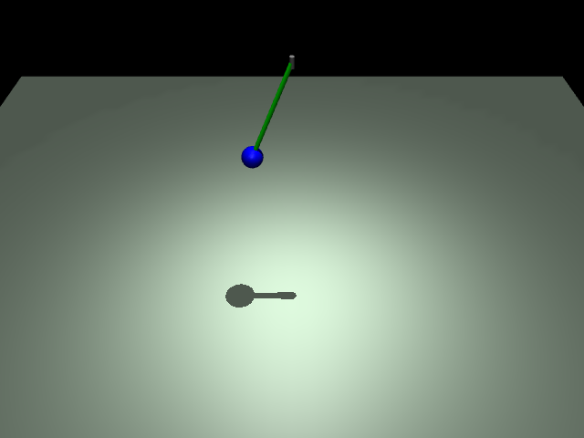

# ex12_pendulum: 진자 운동 (Pendulum)

이 예제는 힌지 관절(`hinge`)을 사용한 진자 시뮬레이션을 구현하며, 댐핑(`damping`) 설정과 초기 상태 제어 방법을 학습합니다.

## 📝 설명
- **힌지 관절:** `axis="0 1 0"` 설정을 통해 Y축 기준 회전 운동을 구현함.
- **댐핑:** `damping="0.5"`를 적용하여 공기 저항이나 마찰과 같은 에너지 감쇠 효과를 시뮬레이션함.
- **초기 상태:** 코드에서 `data.qpos[0] = 1.57` (90도)로 설정하여 진자가 들린 상태에서 시작하도록 함.

## 📸 실행 화면


## 🏃 실행 방법
```bash
uv run main.py
```
