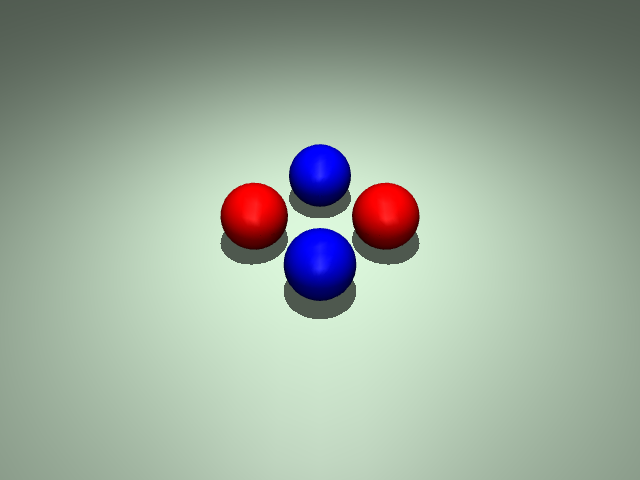

# ex13_collision_filtering: 충돌 필터링 및 탄성 비교

이 예제는 `contype`, `conaffinity`를 이용한 충돌 필터링과 물체별 탄성(`solref`) 차이를 시연합니다.

## 📝 설명
- **충돌 필터링:** 
  - **빨간 공(그룹 1):** 자기들끼리만 충돌함.
  - **파란 공(그룹 2):** 자기들끼리만 충돌함.
  - **상호 교차:** 빨간 공과 파란 공은 서로 통과함.
- **탄성 비교:**
  - **빨간 공:** `solref="0.02 1"` 설정으로 충돌 시 탄성 있게 튕겨 나감.
  - **파란 공:** `solref="0.2 1"` 설정으로 충돌 시 탄성 없이 툭 멈춤.

## 📸 실행 화면


## 🏃 실행 방법
```bash
uv run main.py
```
