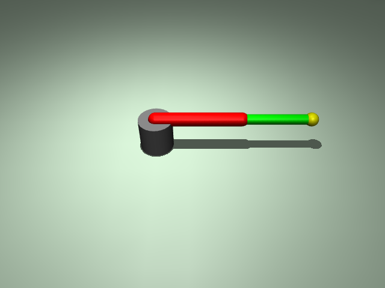

# ex21_motor_control: 모터 제어 (Motor Control)

이 예제는 2자유도 로봇 팔을 구성하고, 액추에이터(`motor`)를 통해 관절에 직접 토크를 가하는 방법을 학습합니다.

## 📝 설명
- **로봇 모델:** 어깨(Joint 1)와 팔꿈치(Joint 2)로 구성된 2자유도 평면 로봇 팔임.
- **액추에이터:** `motor` 태그를 사용하여 각 관절에 토크 제어기를 부착함. `gear` 속성을 통해 입력 토크의 배율을 설정함.
- **제어 루프:** `mj_step`을 통해 물리 연산을 수행하며, `data.ctrl` 배열을 통해 모터 입력을 실시간으로 조절함.

## 📸 실행 화면


## 🏃 실행 방법
```bash
uv run main.py
```
> [!NOTE]
> `launch_passive` 뷰어의 키보드 콜백을 커스텀하려면 추가 설정이 필요하여, 본 예제에서는 기본 루프 구조를 익히는 데 집중함.
