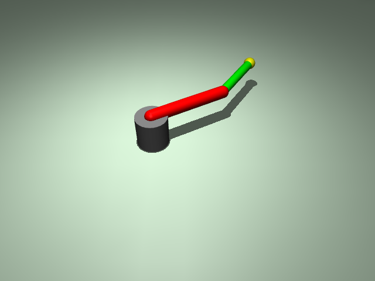

# ex22_pid_control: PID 위치 제어 (PID Control)

이 예제는 2자유도 로봇 팔에 PID 제어기를 적용하여 목표 관절 각도를 정밀하게 추종하는 방법을 학습합니다.

## 📝 설명
- **PID 제어기:** `PIDController` 클래스를 직접 구현하여 비례(P), 적분(I), 미분(D) 게인을 조절함.
- **위치 제어:** 목표 각도(`target`)와 현재 각도(`qpos`)의 오차를 기반으로 모터에 가할 토크를 계산함.
- **센서 모니터링:** `scene.xml`의 `actuatorfrc` 및 `jointpos` 센서를 통해 뷰어의 'Sensor' 창에서 실시간 상태를 확인할 수 있음.

## 📸 실행 화면


## 🏃 실행 방법
```bash
uv run main.py
```

## 🕹️ 사용 방법
- 프로그램을 실행하면 시뮬레이션이 시작되며 3초마다 자동으로 목표 각도가 바뀝니다.
- **모니터링:** 뷰어 우측 상단의 **'Sensor'** 또는 **'Watch'** 탭을 클릭하여 `pos1`, `pos2`(현재 각도)와 `torque1`, `torque2`(제어 토크)를 확인하세요.
- **터미널:** 현재 시간, 목표치, 실제 측정치가 출력됩니다.
