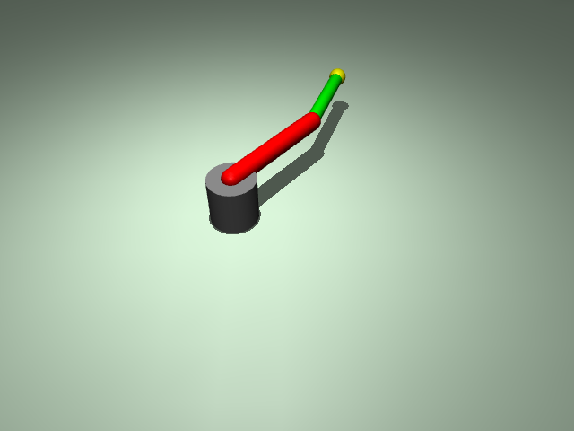

# ex23_motor_encoder: 모터 엔코더 시뮬레이션 (Motor Encoder)

이 예제는 로봇 관절의 위치를 읽을 때 현실적인 센서 특성(노이즈, 해상도 제한)을 시뮬레이션하는 방법을 학습합니다.

## 📝 설명
- **센서 노이즈:** MuJoCo XML의 `noise` 속성을 사용하여 가우시안 노이즈가 포함된 관절 위치 센서를 구현함.
- **해상도(Quantization):** 실제 엔코더의 PPR(Pulses Per Revolution) 특성을 소프트웨어적으로 모사하여 데이터가 특정 단계(Resolution)로 끊겨서 읽히는 현상을 시뮬레이션함.
- **데이터 비교:** 터미널을 통해 물리 엔진의 실제 값(Ground Truth), 노이즈가 섞인 값, 그리고 해상도가 제한된 값을 실시간으로 비교 확인 가능함.

## 📊 결과 분석
프로그램을 실행하면 터미널에 다음과 같은 세 가지 데이터가 출력됩니다:
- **GT (Ground Truth):** 물리 엔진 내부의 참값(결함 없는 이상적인 위치).
- **Noisy:** MuJoCo XML의 `noise` 속성이 적용된 값. 소수점 셋째 자리 부근에서 참값과 미세하게 차이가 나는 것을 볼 수 있음 (가우시안 노이즈).
- **Enc (Encoder):** PPR(2048) 기반의 해상도를 적용한 값. 실제 엔코더처럼 특정 간격(`약 0.003 rad`)으로 데이터가 불연속적으로 변하는 양자화(Quantization) 현상을 확인할 수 있음.

## 📸 실행 화면


## 🏃 실행 방법
```bash
uv run main.py
```
