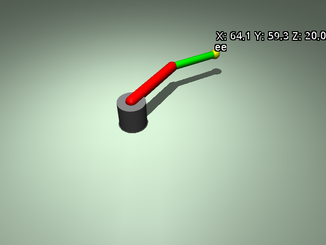

# ex31_fk_2dof: 순운동학 (Forward Kinematics)

이 예제는 2자유도 로봇 팔의 관절 각도를 입력으로 받아 끝단(End-Effector)의 공간 좌표를 계산하는 순운동학(FK)을 학습합니다.

## 📝 설명
- **FK 공식:** 각 관절의 회전 행렬과 링크 길이를 조합하여 끝단의 `(x, y)` 좌표를 구함. 본 예제에서는 직관적인 확인을 위해 **cm 단위**로 변환하여 출력함.
- **실시간 좌표 표시:** 파이썬 코드로 직접 계산한 좌표를 뷰어의 3D 공간(로봇 끝단 옆)에 실시간 텍스트로 표시함.
- **센서 창 통합:** 뷰어 우측 'Sensor' 탭에서도 수동 계산된 좌표를 모니터링할 수 있도록 구현함.

## 💻 주요 코드 스니핏

### 1. 순운동학 계산 함수
간단한 삼각함수를 이용하여 2-DOF 로봇 팔의 위치를 계산합니다.
```python
def forward_kinematics(q, l1, l2):
    q1, q2 = q
    # x = l1*cos(q1) + l2*cos(q1+q2)
    # y = l1*sin(q1) + l2*sin(q1+q2)
    x = l1 * np.cos(q1) + l2 * np.cos(q1 + q2)
    y = l1 * np.sin(q1) + l2 * np.sin(q1 + q2)
    return x, y
```

### 2. 뷰어 3D 텍스트 오버레이
`viewer.user_scn`을 활용하여 계산된 좌표를 뷰어 화면에 직접 투영합니다.
```python
# 뷰어 3D 화면에 cm 단위 X, Y, Z 좌표 표시
viewer.user_scn.ngeom = 1
mujoco.mjv_initGeom(
    viewer.user_scn.geoms[0],
    type=mujoco.mjtGeom.mjGEOM_SPHERE,
    size=[0.01, 0, 0],
    pos=[ee_pos[0], ee_pos[1], ee_pos[2] + 0.1], 
    mat=np.eye(3).flatten(),
    rgba=[0, 0, 0, 0] # 투명
)
label_str = f"X:{calc_x_cm:5.1f}cm Y:{calc_y_cm:5.1f}cm Z:{calc_z_cm:5.1f}cm"
viewer.user_scn.geoms[0].label = label_str
```

## 🕹️ 사용 방법 및 GUI 안내
프로그램을 실행한 후 뷰어 창에서 다음을 수행하여 수치를 확인하세요:
1. **화면 텍스트:** 로봇 끝단을 따라다니는 X, Y, Z (cm) 좌표를 확인합니다.
2. **Sensor 탭 확인:** 뷰어 우측 상단 메뉴에서 **'Sensor'** 아이콘(그래프 모양)을 클릭하면 `calc_x_cm`, `calc_y_cm`, `calc_z_cm` 수치를 실시간으로 볼 수 있습니다.

## 📊 결과 분석
- **단위 일치:** 물리 엔진은 m 단위를 사용하지만, 교육적 목적을 위해 100을 곱한 **cm 단위**로 변환하여 표시함.
- **좌표 확인:** 로봇이 원점에 있을 때(q=[0,0]) 좌표는 (90.0, 0.0) cm 근처가 되어야 함 (Link1(50) + Link2(40)).
- **Z축 고정:** 평면 로봇이므로 X, Y는 변하지만 Z값은 베이스 높이에 따라 일정한 값을 유지함.

## 📸 실행 화면


## 🏃 실행 방법
```bash
uv run main.py
```
