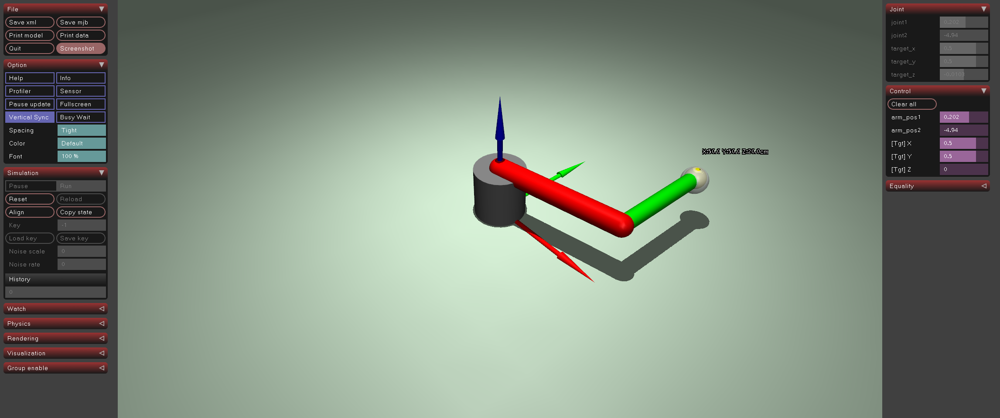

# ex32_ik_site: 역운동학 (Inverse Kinematics)

이 예제는 원하는 목표 위치(Target Position)가 주어졌을 때, 로봇 팔이 해당 위치에 도달하기 위한 관절 각도를 계산하는 역운동학(IK)을 학습합니다.

## 📝 설명
- **자코비안(Jacobian):** 관절 속도와 끝단 속도 사이의 관계를 나타내는 행렬을 MuJoCo의 `mj_jacSite` 함수로 계산함.
- **수치적 IK (Numerical IK):** DLS(Damped Least Squares) 방법을 사용하여 자코비안의 역행렬을 구하고, 이를 통해 목표 지점까지의 오차를 줄이는 관절 변화량(`dq`)을 반복적으로 계산함.
- **슬라이더 제어:** 'Control' 탭의 슬라이더를 통해 목표 `(X, Y, Z)` 위치를 직접 입력할 수 있어 정밀한 조작이 가능함.
- **월드 좌표계 시각화:** 원점에 **빨강(X), 초록(Y), 파랑(Z)** 색상의 화살표 축을 표시하여 방향 확인을 도움.

## 💻 주요 코드 스니핏

### 자코비안 및 화살표 축 구현
```python
# 자코비안 계산 및 제어 입력 업데이트
dq = J.T @ np.linalg.inv(J @ J.T + damping * np.eye(3)) @ error
data.ctrl[0] = data.qpos[0] + dq[0] * step_size

# 화살표 축 추가 (viewer.user_scn 사용)
mujoco.mjv_connector(viewer.user_scn.geoms[idx], mujoco.mjtGeom.mjGEOM_ARROW, 
                    0.01, np.array([0, 0, 0]), np.array([0.5, 0, 0]))
```

## 🕹️ 사용 방법
1. 프로그램을 실행한 후 뷰어 우측 상단 메뉴에서 **'Control'** 탭을 클릭하여 슬라이더를 활성화합니다.
2. **목표 위치 설정:** `[Tgt] X`, `[Tgt] Y`, `[Tgt] Z` 슬라이더를 마우스로 조작하여 흰색 구체(`target`)의 위치를 변경합니다.
3. **추적 확인:** 로봇 팔이 실시간으로 계산된 역운동학 솔루션에 따라 구체의 위치를 즉각적으로 따라오는지 관찰합니다.
4. **좌표 확인:** 로봇 끝단 옆에 표시되는 실시간 **cm 단위 좌표**를 통해 정확한 도달 여부를 확인합니다.

## 📸 실행 화면


## 🏃 실행 방법
```bash
uv run main.py
```
