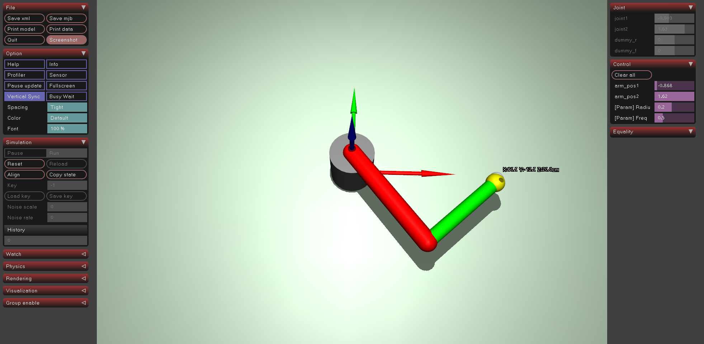

# ex33_trajectory_tracking: 궤적 추종

## 📝 설명
- **궤적 생성 (Trajectory Generation):** 시간에 따라 변화하는 목표 좌표 $(X, Y, Z)$를 계산하여 로봇 팔의 끝단(End-effector)이 특정 경로를 따라 움직이도록 함. 본 예제에서는 원형(Circular) 궤적을 사용함.
- **실시간 파라미터 조정:** 사이드바 슬라이더를 통해 원의 **반지름(Radius)**과 **회전 주파수(Frequency)**를 시뮬레이션 중 즉시 변경할 수 있음.
- **수치적 IK 활용:** `ex32`에서 구현한 DLS(Damped Least Squares) 기반 역운동학 엔진을 궤적의 각 점에 대해 실시간으로 적용함.
- **추종 정밀도 (Tracking Accuracy):** 물리 엔진의 지연(Lag)을 최소화하기 위해 높은 제어 게인(`kp`)과 최적화된 `step_size=1.0`을 사용함.

## 🔬 정밀도 및 특이점 심층 분석 (Singularity & DLS)
수치적 IK 제어에서 완벽한 원을 그리지 못하거나 미세한 오차가 발생하는 원인을 분석합니다.

### 1. 자코비안 특이점 (Jacobian Singularity)
2자유도 로봇 팔에서 특이점은 팔이 완전히 펴지는 지점(가동 범위의 한계)에서 발생합니다.
*   **물리적 한계**: 첫 번째 링크(0.5m) + 두 번째 링크(0.4m) = 총 **0.9m**.
*   **궤적의 범위**: 원의 중심(0.45m) + 반지름(0.4m) = 최대 **0.85m**.
*   **현상**: 궤적의 바깥쪽 끝(0.85m)이 로봇 팔의 최대 도달 거리(0.9m)에 매우 인접해 있습니다. 특이점에 가까워질수록 자코비안 행렬의 역행렬 값이 무한대로 커지려 하며, 관절 속도가 폭주할 위험이 생깁니다.

### 2. DLS(Damped Least Squares)의 트레이드오프
특이점에서의 시스템 붕괴를 막기 위해 우리는 대각 요소를 추가하는 댐핑(`damping`) 항을 사용합니다.
$$dq = J^T (J J^T + \lambda^2 I)^{-1} e$$
*   **장점 (안정성)**: 특이점 근처에서도 관절 각도의 변화량($dq$)이 무한히 커지지 않도록 억제하여 시뮬레이션을 안정화합니다.
*   **단점 (정밀도)**: 수학적으로 완벽한 역행렬이 아닌 '감쇠된 근사치'를 구하는 것이므로, 특이점에 가까워질수록 목표 지점을 완벽히 쫓지 못하고 미세하게 안쪽으로 밀리는 오차가 발생합니다.
*   **결론**: **"시뮬레이션의 안정성을 위해 정밀도를 일부 희생"**하는 수치해석적 타협입니다.

### 3. 제어 지연 및 동역학 (Control & Dynamics)
*   **지연(Lag)**: `step_size`가 1.0보다 작으면 목표를 쫓아가는 속도가 늦어져 원이 찌그러져 보입니다. (본 예제는 1.0으로 최적화됨)
*   **동역학**: 중력, 관성, 링크의 댐핑 등 물리적 요인이 순수 기하학적 IK 계산과 상충될 수 있습니다.

## 💻 주요 코드 스니핏

### 원형 궤적 계산
```python
# 시간에 따른 타겟 위치 계산
target_x = cx + radius * np.cos(2 * np.pi * freq * data.time)
target_y = cy + radius * np.sin(2 * np.pi * freq * data.time)
data.mocap_pos[target_mocap_id] = [target_x, target_y, target_z]
```

### 사이드바 파라미터 연동
```xml
<!-- XML에서 파라미터용 더미 조인트와 액추에이터 정의 -->
<position name="[Param] Radius" joint="dummy_r" kp="0" ctrlrange="0.05 0.4" />
```

## 🕹️ 사용 방법
1. 프로그램을 실행한 후 뷰어 우측 상단 메뉴에서 **'Control'** 탭을 클릭합니다.
2. **`[Param] Radius`**: 궤적 원의 크기를 조절합니다.
3. **`[Param] Freq`**: 로봇 팔이 원을 도는 속도를 조절합니다.
4. **시각화 확인:** 원점의 축 화살표와 로봇 끝단 옆에 표시되는 실시간 **cm 단위 좌표**를 관찰합니다.

## 📸 실행 화면

