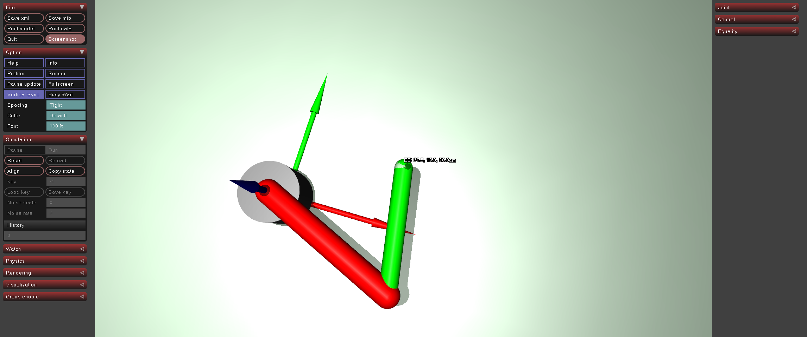

# ex41_camera_setup: 카메라 설정 및 다중 뷰

## 📝 설명
- **카메라 정의:** MuJoCo XML의 `<camera>` 태그를 사용하여 고정된 위치(`Fixed View`), 수직 조감도(`Top View`), 로봇 손단에 부착된 이동 카메라(`Hand View`)를 설정함.
- **Hand-eye View:** 로봇의 부위(Body) 내부에 카메라를 정의하면 해당 부위가 움직일 때 카메라가 함께 이동하는 1인칭 시점(Egocentric view)을 구현함.
- **키보드 제어:** 숫자 키 **1, 2, 3, 4**를 눌러 시뮬레이션 중 실시간으로 관찰 시점을 즉시 전환할 수 있음.

## 💻 주요 코드 스니핏

### 키보드 콜백을 통한 카메라 전환
```python
def key_callback(keycode):
    if chr(keycode) == '1':
        viewer.cam.type = mujoco.mjtCamera.mjCAMERA_FREE
    elif chr(keycode) == '2':
        viewer.cam.type = mujoco.mjtCamera.mjCAMERA_FIXED
        viewer.cam.fixedcamid = 0 # Fixed View
```

## 🕹️ 사용 방법
1. 프로그램을 실행한 후 다음 숫자 키를 눌러 카메라 시점을 전환합니다:
   - **`1`**: Free View (자유 시점)
   - **`2`**: Fixed View (측면 고정 시점)
   - **`3`**: Top View (상단 조감도)
   - **`4`**: Hand View (로봇 팔 1인칭 시점)
2. 각 시점에서 로봇 끝단 옆에 표시되는 **cm 단위 좌표**와 **1m 축 화살표**를 확인합니다.

## 📸 실행 화면

