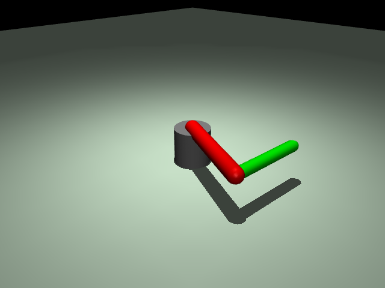
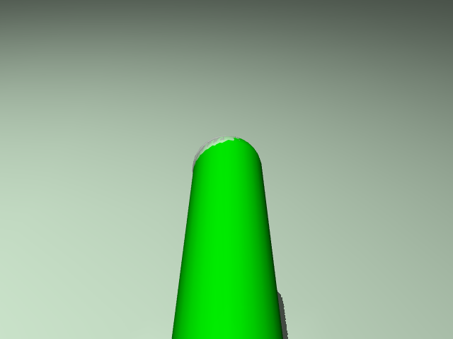

# ex42_rgb_render: 오프스크린 RGB 렌더링

## 📝 설명
- **오프스크린 렌더링 (Off-screen Rendering):** 모니터에 출력되는 뷰어 화면과는 별개로, 메모리 상에서 이미지를 생성하는 기술. AI 모델 인풋(Vision-based Policy)이나 정기적인 관찰 데이터 수집에 필수적임.
- **`mujoco.Renderer`:** MuJoCo 3.0 이상에서 제공하는 고수준 렌더링 클래스로, 모델 정보를 바탕으로 RGB 이미지 및 Depth 맵을 손쉽게 획득할 수 있게 해줌.
- **이미지 변환:** MuJoCo가 제공하는 원시(Raw) 바이트 데이터를 `numpy` 배열로 변환하고, OpenCV를 통해 이미지 파일(PNG)로 저장하는 과정을 학습함.

## 💻 주요 코드 스니핏

### 렌더러 초기화 및 캡처
```python
# 렌더러 생성 (해상도 지정)
renderer = mujoco.Renderer(model, height=480, width=640)

# 특정 카메라 시점으로 장면 업데이트 및 렌더링
renderer.update_scene(data, camera="Hand View")
rgb_img = renderer.render() # numpy array (H, W, 3) 반환
```

### OpenCV를 이용한 이미지 저장
```python
# MuJoCo(RGB) -> OpenCV(BGR) 색상 채널 변경 후 저장
bgr_img = cv2.cvtColor(rgb_img, cv2.COLOR_RGB2BGR)
cv2.imwrite("output.png", bgr_img)
```

## 🕹️ 사용 방법
1. 프로그램을 실행한 후 시뮬레이션 창을 클릭합니다.
2. **`S`** 키를 누르면 다음의 두 가지 시점에 대한 이미지가 현재 폴더에 즉시 저장됩니다:
   - `capture_fixed.png`: 측면 고정 뷰
   - `capture_hand.png`: 로봇 팔 1인칭 뷰
3. 저장된 파일들을 열어 오프스크린 렌더링 결과를 확인합니다.

## 📸 실행 화면


