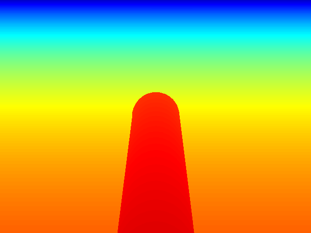

# ex43_depth_render: 오프스크린 깊이(Depth) 렌더링

## 📝 설명
- **깊이 맵 (Depth Map):** 카메라로부터 각 픽셀에 해당하는 물체까지의 거리 정보를 담은 이미지. RGB 정보와 결합하여 3D 공간의 형상(Point Cloud 등)을 복원하거나 물체의 거리를 판별하는 데 사용됨.
- **`mujoco.Renderer(depth=True)`:** 무조코 렌더러에서 깊이 정보 추출 기능을 활성화하면, `render()` 호출 시 실제 거리(m) 단위의 float32 배열을 반환함.
- **시각화 (Visualization):** float 데이터를 그대로 이미지 파일로 저장하면 확인이 어려우므로, 특정 범위를 정규화하고 컬러맵(Colormap)을 적용하여 시각적으로 이해하기 쉬운 형태로 변환함.

## 💻 주요 코드 스니핏

### 깊이 렌더링 및 정규화
```python
# 깊이 렌더링 활성화 및 데이터 획득
renderer.enable_depth_rendering()
renderer.update_scene(data, camera="Hand View")
depth = renderer.render() # (H, W) float32 (meters)

# 시각화를 위한 0~2.0m 범위 정규화 및 컬러맵 적용
depth_norm = (np.clip(depth, 0, 2) / 2.0 * 255).astype(np.uint8)
depth_color = cv2.applyColorMap(255 - depth_norm, cv2.COLORMAP_JET)
```

## 🕹️ 사용 방법
1. 프로그램을 실행한 후 시뮬레이션 창을 클릭합니다.
2. **`S`** 키를 누르면 다음의 두 가지 시점에 대한 깊이 맵이 현재 폴더에 즉시 저장됩니다:
   - `depth_fixed.png`: 측면 고정 뷰의 깊이 정보
   - `depth_hand.png`: 로봇 팔 1인칭 뷰의 깊이 정보
3. 저장된 파일들을 열어 무지개색(JET)으로 표현된 거리 정보를 확인합니다. (빨간색에 가까울수록 가깝고, 파란색에 가까울수록 멀리 있음)

## 📸 실행 화면


