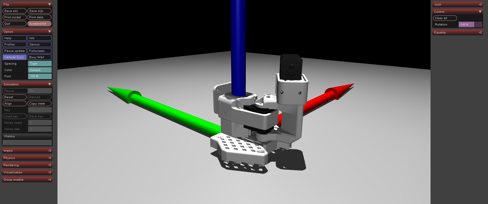

# ex51_lerobot_base: 베이스 회전 동작 이해

## 📝 설명
- **LeRobot SO-100 베이스:** 로봇 팔의 기초가 되는 부분으로, 전체 팔을 좌우로 회전시키는 1자유도(Yaw)를 담당함.
- **STL 에셋 활용:** 공식 MuJoCo Menagerie에서 제공하는 최적화된 STL 파일을 사용하여 실제 하드웨어와 동일한 외형을 모델링함.
- **좌표계 이해:** 로봇의 원점(Origin)이 어디인지, 그리고 첫 번째 관절이 회전할 때 좌표축이 어떻게 변화하는지 시각적으로 확인 가능함.

## 💻 주요 구성 요소
- `base_link`: 바닥에 고정된 정적 부품.
- `shoulder_rotation`: 베이스 위에 올라가 실제 회전을 수행하는 링크.
- `base_rotation` (Joint): `-2.2` rad ~ `2.2` rad 범위의 회전각을 가짐.

## 🕹️ 사용 방법
1. 프로그램을 실행합니다.
2. 우측 사이드바의 **`base_rotation_actuator`** 슬라이더를 조작하여 베이스를 회전시켜 봅니다.
3. 원점에 표시된 1m 길이의 RGB 축(X, Y, Z)을 기준으로 로봇의 상대적 위치를 파악합니다.

## 📸 실행 화면

