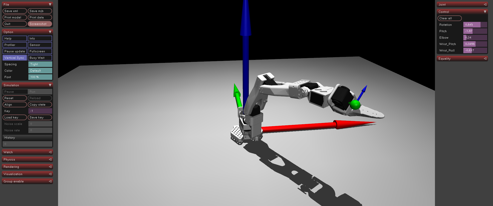

# ex52_lerobot_arms: 5-DOF 팔 구조 조립 및 이해

## 📝 설명
- **LeRobot SO-100 팔 구조:** 그리퍼를 제외한 전체 팔 구조를 조립하여 5자유도(Rotation, Pitch, Elbow, Wrist Pitch, Wrist Roll) 동작을 구현함.
- **공식 모델 통합:** `trs_so_arm100` 메쉬와 키네마틱 체인을 사용하여 실제 하드웨어와 동일한 기하학적 구조를 가짐.

## ⚙️ 물리 파라미터 상세 설명 (Physics & Control Parameters)
시뮬레이션의 안정성과 실제 로봇과 유사한 거동을 위해 적용된 주요 파라미터들의 의미임.

### 1. 액추에이터 제어 게인 (Actuator Gains)
- **`kp` (Proportional Gain):** 위치 비례 게인. 목표 각도와 현재 각도의 차이에 비례하여 복원력을 발생시킴. 값이 너무 크면 진동(Oscillation)이 발생하고, 너무 작으면 목표 지점에 도달하지 못함.
- **`kv` (Velocity/Derivative Gain):** 속도 비례 게인 (D-gain 효과). 관절이 움직이는 속도에 저항하는 힘을 주어 목표 지점 근처에서의 오버슈트와 덜덜거림을 방지함.
- **`forcerange`:** 액추에이터가 낼 수 있는 최소/최대 토크 범위. 실제 서보 모터의 출력 한계를 모사함.

### 2. 관절 물리 속성 (Joint Properties)
- **`damping`:** 물리적 감쇠력. 관절의 각속도에 저항하는 힘을 발생시켜 움직임을 부드럽게 만들고 에너지를 흡수함.
- **`frictionloss`:** 정지 마찰력. 관절을 움직이기 위해 필요한 최소 토크를 정의함. 이 값이 적절해야 중력에 의해 팔이 아래로 처지는 현상을 막고 위치를 고정할 수 있음.
- **`armature`:** 관절 주위에 가상의 관성(Inertia)을 추가함. 수치적 안정성을 높여 급격한 가속도로 인한 시뮬레이션 폭발을 방지함.

## 🏗️ 기구학적 구조 (Kinematics Structure)
로봇 팔은 직렬 연쇄(Serial Chain) 구조로, 각 부모 Body 내부에 자식 Body가 중첩된 계층 구조로 정의됨.

### XML 구성 요소 계층
```xml
<body name="Base"> <!-- 원점 고정 -->
    <body name="Rotation_Pitch"> <!-- 1. Yaw (Base Rotation) -->
        <body name="Upper_Arm"> <!-- 2. Shoulder Pitch -->
            <body name="Lower_Arm"> <!-- 3. Elbow Pitch -->
                <body name="Wrist_Pitch_Roll"> <!-- 4. Wrist Pitch -->
                    <body name="Fixed_Jaw"> <!-- 5. Wrist Roll -->
                        <site name="hand_axis"/> <!-- 손끝 좌표계 정의 -->
                    </body>
                </body>
            </body>
        </body>
    </body>
</body>
```

### 손끝(End-Effector) 좌표 시각화
Python 코드에서 `mj_name2id`를 통해 손끝에 정의된 `site`의 전역 좌표(`site_xpos`)와 회전 행렬(`site_xmat`)을 가져와 실시간으로 좌표축을 그림.
```python
# 손끝(hand_axis site) 축 시각화 (0.1m 길이)
site_id = mujoco.mj_name2id(model, mujoco.mjtObj.mjOBJ_SITE, "hand_axis")
if site_id != -1:
    site_pos = data.site_xpos[site_id]
    site_mat = data.site_xmat[site_id].reshape(3, 3)
    for i, color in zip([3, 4, 5], [[1, 0, 0, 1], [0, 1, 0, 1], [0, 0, 1, 1]]):
        axis_dir = site_mat[:, i-3] * 0.1 # 로컬 축 방향 계산
        mujoco.mjv_connector(viewer.user_scn.geoms[i], type, 0.002, site_pos, site_pos + axis_dir)
```

## 🕹️ 사용 방법
1. 프로그램을 실행합니다.
2. 우측 사이드바의 5개 슬라이더를 조작하여 각 관절의 움직임을 확인합니다.
3. 원점(1m 축)과 손끝(0.1m 축)에 표시된 좌표계를 통해 로봇의 자세 변화를 직관적으로 파악합니다.

## 📸 실행 화면

