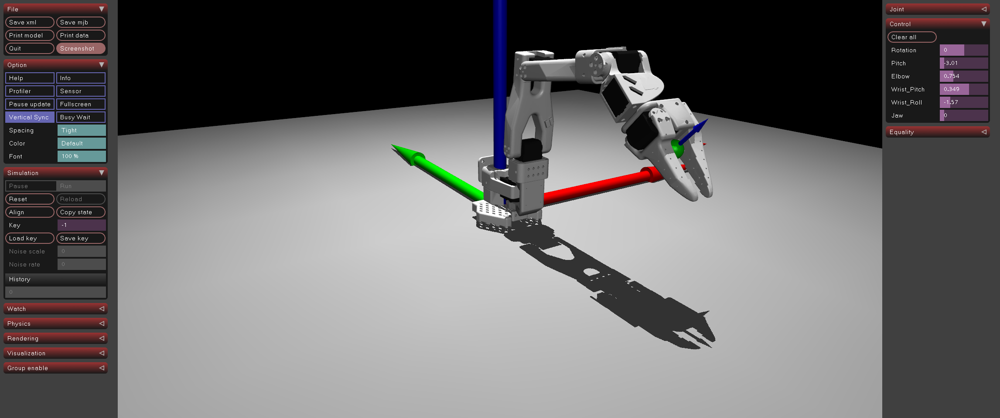

# ex53_lerobot_gripper: 전체 로봇 조립 및 그리퍼 이해

## 📝 설명
- **Full LeRobot SO-100:** 전체 6자유도의 관절(5개 Arm + 1개 Gripper)을 모두 조립하여 완성된 로봇 모델을 구현함.
- **그리퍼 메커니즘:** 고정된 턱(Fixed Jaw)과 움직이는 턱(Moving Jaw)으로 구성된 1자유도 그리퍼의 동작 원리를 이해함.
- **물리적 접촉(Grasping):** 손가락에 해당하는 부위에 고마찰 충돌체(Collision Pads)를 추가하여 물체를 안정적으로 집을 수 있도록 설정함.

## ⚙️ 그리퍼 물리 설정 (Gripper Physics)
안정적인 물체 조작(Manipulation)을 위해 그리퍼에 특수한 물리 속성을 부여함.

### 1. 충돌 패드 (Collision Pads)
그리퍼 메쉬 자체는 복잡한 형상이므로, 실제 접촉이 일어나는 안쪽 면에 단순한 상자(Box) 형태의 충돌체를 겹쳐서 배치함.
```xml
<default class="finger_collision">
    <!-- solimp, solref: 충돌 시의 탄성 및 관통 방지 설정 -->
    <!-- friction: 높은 마찰력(1.0)을 부여하여 물체가 미끄러지지 않게 함 -->
    <geom type="box" solimp="2 1 0.01" solref="0.01 1" friction="1 0.005 0.0001"/>
</default>
```

### 2. 그리퍼 제어 (Jaw Actuator)
그리퍼 관절은 `Jaw`라는 이름으로 정의되며, 사이드바를 통해 `0`(닫힘)에서 `1.75`(열림) rad 범위로 제어 가능함.

## 🏗️ 전체 계층 구조 (Full Hierarchy)
`Base` → `Arms` → `Gripper`로 이어지는 최종 계층 구조임.
```xml
<body name="Base">
    ... (Arm Joints) ...
    <body name="Fixed_Jaw"> <!-- 5번째 관절 Wrist Roll에 부착 -->
        <geom name="fixed_jaw_pad" class="finger_collision"/>
        <body name="Moving_Jaw"> <!-- 그리퍼 관절 -->
            <joint name="Jaw"/>
            <geom name="moving_jaw_pad" class="finger_collision"/>
        </body>
    </body>
</body>
```

## 🕹️ 사용 방법
1. 프로그램을 실행합니다.
2. 로봇 앞에 주황색 **테스트 박스**가 배치되어 있습니다.
3. 사이드바의 슬라이더들을 조작하여 박스 위치로 이동한 뒤, **`Jaw`** 슬라이더를 0 근처로 움직여 박스를 집어봅니다.
4. 박스를 들어 올릴 때 그리퍼의 마찰력과 물리적 접촉 상태를 관찰합니다.

## 📸 실행 화면

